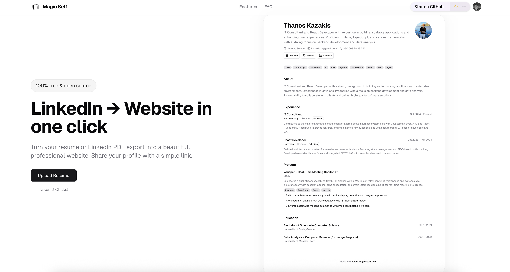

<div align="center">

<h1>✨ Magic Self ✨</h1>

### Transform your resume PDF into a beautiful personal website instantly

A professional portfolio site featuring AI-powered resume extraction and custom usernames — perfect for developers, designers, and job seekers.

**Tech Stack:**

[](https://nextjs.org/)
[](https://www.typescriptlang.org/)
[](https://react.dev/)
[](https://tailwindcss.com/)
[](https://supabase.com/)
[](https://www.postgresql.org/)
[](https://clerk.com/)
[](https://x.ai/)
[](https://tanstack.com/query)
[](https://zod.dev/)

[Demo](https://magic-self.dev) · [Report Bug](https://github.com/ThanosKa/magic-self/issues) · [Request Feature](https://github.com/ThanosKa/magic-self/issues)

[](https://x.com/KazakisThanos)
[](https://buymeacoffee.com/thaka)

<div align="left">

## 📸 Screenshot



</div>

</div>

---

## Table of Contents

- [About](#about)
- [Features](#features)
- [Demo](#demo)
- [Built With](#built-with)
- [How It Works](#how-it-works)
- [Getting Started](#getting-started)
  - [Prerequisites](#prerequisites)
  - [Installation](#installation)
  - [Environment Setup](#environment-setup)
  - [Database Setup](#database-setup)
- [Usage](#usage)
- [Project Structure](#project-structure)
- [Deployment](#deployment)
- [Contributing](#contributing)
- [License](#license)
- [Acknowledgments](#acknowledgments)
- [Contact](#contact)

---

## About

**magic-self.dev** is an open-source platform that converts your resume PDF into a stunning, shareable personal website in seconds. Upload your resume, get a custom `magic-self.dev/yourname` URL, and showcase your professional experience with a clean, modern design.

Perfect for:

- Students and recent graduates building their online presence
- Job seekers who want a quick, professional portfolio
- Developers who need a personal landing page
- Designers looking to showcase their work

---

## Features

- **One-Click Conversion** — Upload a PDF and get a live website in seconds
- **AI-Powered Extraction** — Automatically structures your resume data using Grok 4.1 Fast
- **Custom URLs** — Claim your own `magic-self.dev/yourname` subdomain
- **Live Editing** — Edit your information directly in the preview
- **Light Theme** — Clean and modern design
- **Fully Responsive** — Works perfectly on mobile, tablet, and desktop
- **Secure & Private** — Your data is encrypted and stored securely
- **100% Open Source** — Apache 2.0 licensed and self-hostable

### SEO & Performance

- **Search Engine Optimized** — Comprehensive metadata with Open Graph and Twitter Cards
- **Structured Data** — JSON-LD schema markup for better search visibility
- **Dynamic Sitemap** — Auto-generated sitemap.xml with all published resumes
- **Fast Loading** — Optimized images, preloaded assets, and Core Web Vitals tracking
- **Robots.txt** — Proper crawl directives for search engines
- **Canonical URLs** — Prevent duplicate content issues
- **Rich Social Previews** — Beautiful link previews on Twitter, LinkedIn, and Facebook

### Enhanced UX

- **Smooth Navigation** — Scroll-to-section links in the navbar (Features, FAQ)
- **Animated Components** — Polished micro-interactions and shimmer effects
- **Interactive Buttons** — Hover animations on CTAs and navigation elements
- **Performance Monitoring** — Real-time Web Vitals tracking in development

---

## Demo

Visit [magic-self.dev](https://magic-self.dev) to try it out!

**Quick preview of the upload flow:**

1. Upload PDF → 2. AI extracts data → 3. Edit & customize → 4. Publish live

---

## How It Works

For developers interested in the technical architecture, see the comprehensive guide:

[HOW_IT_WORKS.md](./HOW_IT_WORKS.md) - Complete technical documentation covering:

- System architecture and database schema
- File storage and bucket structure
- Draft vs live states
- Complete flow from upload to published website
- API routes and code examples

---

## Built With

**Core Stack:**

| Technology                                    | Purpose                               |
| --------------------------------------------- | ------------------------------------- |
| [Next.js 16](https://nextjs.org/)             | React framework with App Router + SEO |
| [TypeScript](https://www.typescriptlang.org/) | Type-safe development                 |
| [Tailwind CSS v4](https://tailwindcss.com/)   | Utility-first styling                 |
| [shadcn/ui](https://ui.shadcn.com/)           | Accessible component library          |
| [Supabase](https://supabase.com/)             | PostgreSQL database & storage         |
| [Clerk](https://clerk.com/)                   | Authentication                        |
| [OpenRouter](https://openrouter.ai/)          | AI-powered resume parsing (Grok 4.1)  |
| [TanStack Query](https://tanstack.com/query)  | Server state management               |
| [Zod](https://zod.dev/)                       | Schema validation                     |

**SEO & Performance:**

- **Next.js Metadata API** — Dynamic SEO tags per route
- **JSON-LD** — Structured data for rich search results
- **Web Vitals** — Core Web Vitals monitoring (LCP, CLS, INP)
- **Open Graph** — Social media previews
- **Dynamic Sitemap** — Auto-generated from database
- **robots.txt** — Search engine crawl optimization

---

## Getting Started

Follow these steps to set up magic-self.dev locally.

### Prerequisites

Ensure you have the following installed:

- **Node.js** 18 or higher
- **pnpm** (recommended) or npm
- **Git**

```bash
# Check your versions
node --version
pnpm --version
```

You'll also need accounts for:

- [Supabase](https://supabase.com) (free tier)
- [Clerk](https://clerk.com) (free tier)
- [OpenRouter](https://openrouter.ai) (pay-as-you-go)

---

### Installation

1. **Clone the repository**

```bash
git clone https://github.com/ThanosKa/magic-self.git
cd magic-self
```

2. **Install dependencies**

```bash
pnpm install
```

---

### Environment Setup

1. **Copy the example environment file**

```bash
# macOS/Linux
cp .env.example .env.local

# Windows (PowerShell)
Copy-Item .env.example .env.local
```

2. **Configure your environment variables**

Open `.env.local` and fill in your credentials:

```env
# Supabase
NEXT_PUBLIC_SUPABASE_URL=https://your-project.supabase.co
NEXT_PUBLIC_SUPABASE_ANON_KEY=your_anon_key
SUPABASE_SERVICE_ROLE_KEY=your_service_role_key
SUPABASE_DB_URL=postgresql://postgres:[password]@[host]:[port]/postgres

# Clerk
NEXT_PUBLIC_CLERK_PUBLISHABLE_KEY=pk_test_xxxxx
CLERK_SECRET_KEY=sk_test_xxxxx
CLERK_WEBHOOK_SIGNING_SECRET=whsec_xxxxx

# OpenRouter
OPENROUTER_API_KEY=sk-or-v1-xxxxx

# App URL (for local dev)
NEXT_PUBLIC_APP_URL=http://localhost:3000

```

> **Tip:** Get your Supabase credentials from Project Settings → API

---

### Database Setup

1. **Create a Supabase project** at [supabase.com](https://supabase.com)

2. **Run the SQL migrations**

```bash
psql "$SUPABASE_DB_URL" -f scripts/001_create_resumes_table.sql -f scripts/002_create_usernames_table.sql
```

Alternatively, copy the contents of each SQL file from `scripts/` and run them in the Supabase SQL editor.

3. **Create a Storage bucket (required for uploads)**

- In Supabase, go to **Storage** → **Create bucket**
- Name it `resumes`
- Set it to **Public** (the upload flow expects public access to the bucket)

4. **Configure Row Level Security (RLS)**

Run this SQL in the Supabase SQL editor:

```sql
-- Enable RLS on tables
ALTER TABLE resumes ENABLE ROW LEVEL SECURITY;
ALTER TABLE usernames ENABLE ROW LEVEL SECURITY;

-- Service role policies (for server-side operations)
CREATE POLICY "Service role has full access to resumes"
ON resumes FOR ALL
USING (true)
WITH CHECK (true);

CREATE POLICY "Service role has full access to usernames"
ON usernames FOR ALL
USING (true)
WITH CHECK (true);
```

5. **Start the development server**

```bash
pnpm dev
```

Open [http://localhost:3000](http://localhost:3000) to see your app!

### Clerk Webhooks Setup

Magic Self uses Clerk webhooks to automatically clean up user data when accounts are deleted. This ensures GDPR compliance and prevents orphaned data.

1. **Create a webhook endpoint in Clerk**
   - Go to your [Clerk Dashboard](https://dashboard.clerk.com)
   - Navigate to **Webhooks** in the sidebar
   - Click **Add Endpoint**
   - Set the URL to: `https://yourdomain.com/api/webhooks/clerk`
   - Select the **user.deleted** event
   - Copy the **Signing Secret**

2. **Configure the webhook secret**

   Add the signing secret to your environment variables:

   ```env
   CLERK_WEBHOOK_SIGNING_SECRET=whsec_your_signing_secret_here
   ```

3. **Webhook functionality**

   The webhook handler (`app/api/webhooks/clerk/route.ts`) automatically:
   - Verifies webhook signatures for security
   - Processes `user.deleted` events
   - Cleans up all user data from Supabase (resumes, usernames, uploaded files)
   - Logs all operations for debugging

---

## Usage

### Uploading a Resume

1. Sign up or log in at `/sign-up` or `/sign-in`
2. Click **Upload Resume** on the dashboard
3. Select your PDF file (LinkedIn export or resume)
4. Wait for AI to extract and structure your data
5. Review and edit your information in the preview
6. Claim your custom username (e.g., `magic-self.dev/johnsmith`)
7. Click **Publish** to make your site live

### Editing Your Profile

- Navigate to `/dashboard` to update your information
- Changes are saved automatically
- Switch between draft and live modes

---

## Project Structure

```
magic-self/
├── app/
│   ├── [username]/              # Public profile pages
│   │   ├── og/                  # Open Graph image generation
│   │   └── page.tsx             # Dynamic user profile pages
│   ├── api/                     # API routes
│   │   ├── clear-file/          # File cleanup operations
│   │   ├── generate/            # Resume generation endpoint
│   │   ├── resume/              # Resume CRUD operations
│   │   ├── upload/              # PDF upload handler
│   │   ├── user/
│   │   │   ├── delete/          # User account deletion
│   │   │   └── user-image/      # User profile images
│   │   ├── username/            # Username management
│   │   │   ├── check/           # Username availability checking
│   │   │   └── route.ts         # Username operations
│   │   └── webhooks/
│   │       └── clerk/           # Clerk webhook handlers
│   ├── preview/                 # Resume preview & editor
│   ├── render/                  # Static site rendering
│   ├── sign-up/                 # Clerk registration
│   │   └── [[...sign-up]]/      # Catch-all sign-up routes
│   └── upload/                  # Resume upload page
├── components/
│   ├── landing/                 # Landing page components
│   │   ├── faq.tsx             # FAQ section
│   │   ├── features.tsx        # Features showcase
│   │   ├── footer.tsx          # Site footer
│   │   ├── hero.tsx            # Hero section
│   │   ├── scroll-header.tsx   # Animated header
│   │   └── top-menu.tsx        # Navigation menu
│   ├── preview/                 # Preview-specific components
│   │   ├── discard-dialog.tsx  # Discard changes dialog
│   │   ├── preview-client.tsx  # Client-side preview
│   │   └── username-edit-dialog.tsx # Username editing
│   ├── resume/                  # Resume display components
│   │   ├── add-skill-dialog.tsx # Add skills dialog
│   │   ├── edit-resume.tsx     # Resume editor
│   │   ├── full-resume.tsx     # Complete resume view
│   │   ├── resume-education.tsx # Education section
│   │   ├── resume-header.tsx   # Resume header
│   │   ├── resume-projects.tsx # Projects section
│   │   ├── resume-section.tsx  # Generic section
│   │   ├── resume-skills.tsx   # Skills section
│   │   ├── resume-summary.tsx  # Summary section
│   │   └── resume-work-experience.tsx # Work experience
│   ├── ui/                      # shadcn/ui components
│   │   ├── accordion.tsx        # Accordion component
│   │   ├── alert-dialog.tsx     # Alert dialog
│   │   ├── alert.tsx            # Alert component
│   │   ├── animated-badge.tsx   # Animated badges
│   │   ├── animated-shiny-text.tsx # Animated text
│   │   ├── avatar.tsx           # Avatar component
│   │   ├── badge.tsx            # Badge component
│   │   ├── blur-fade.tsx        # Blur fade effect
│   │   ├── border-beam.tsx      # Border beam effect
│   │   ├── button.tsx           # Button component
│   │   ├── card.tsx             # Card component
│   │   ├── collapsible.tsx      # Collapsible component
│   │   ├── dialog.tsx           # Dialog component
│   │   ├── drawer.tsx           # Drawer component
│   │   ├── input.tsx            # Input component
│   │   ├── label.tsx            # Label component
│   │   ├── progress.tsx         # Progress component
│   │   ├── separator.tsx        # Separator component
│   │   ├── spinner.tsx          # Loading spinner
│   │   ├── status.tsx           # Status component
│   │   └── textarea.tsx         # Textarea component
│   ├── upload/                  # Upload flow components
│   │   ├── file-upload.tsx      # File upload component
│   │   └── workspace-client.tsx # Client-side workspace
│   ├── providers/               # Context providers
│   │   └── react-query-provider.tsx # React Query provider
│   ├── shared/                  # Shared components
│   │   └── github-stars.tsx     # GitHub stars component
│   ├── logo.tsx                 # Logo component
│   ├── logos/                   # Logo assets
│   ├── theme-provider.tsx       # Theme provider
│   └── web-vitals.tsx           # Web vitals tracking
├── lib/
│   ├── schemas/                 # Zod validation schemas
│   │   └── resume.ts            # Resume data schema
│   ├── server/                  # Server-only utilities
│   │   ├── ai/                  # AI generation logic
│   │   │   └── generate-resume-object.ts # Resume parsing
│   │   ├── logger.ts            # Logging utility
│   │   ├── scrape-pdf-content.ts # PDF text extraction
│   │   ├── supabase-actions.ts  # Database operations
│   │   └── username.ts          # Username utilities
│   ├── supabase/                # Supabase configurations
│   │   ├── admin.ts             # Admin client
│   │   ├── client.ts            # Client configuration
│   │   └── server.ts            # Server configuration
│   ├── utils/                   # Utility functions
│   │   └── scroll.ts            # Scroll utilities
│   ├── config.ts                # Application configuration
│   ├── routes.ts                # Route definitions
│   └── utils.ts                 # General utilities
├── hooks/                       # Custom React hooks
│   ├── use-file-upload.ts       # File upload hook
│   ├── use-mobile.ts            # Mobile detection hook
│   └── use-user-actions.ts      # User action hooks
├── scripts/                     # Database migration scripts
│   ├── 001_create_resumes_table.sql
│   ├── 002_create_usernames_table.sql
│   └── check-seo.mjs            # SEO validation script
├── public/                      # Static assets
│   ├── landing.png              # Landing page screenshot
│   ├── linkedin.png             # LinkedIn logo
│   ├── oauth-logo.png           # OAuth logo
│   ├── oauth-logo.svg           # OAuth logo SVG
│   └── scr2.png                 # Additional screenshot
└── styles/
    └── globals.css              # Global styles
```

---

## Deployment

### Deploy to Vercel

The easiest way to deploy magic-self.dev is with Vercel:

1. Push your code to GitHub
2. Import the project in [Vercel](https://vercel.com)
3. Add all environment variables from `.env.local`
4. Update `NEXT_PUBLIC_APP_URL` to your production domain
5. Deploy!

[](https://vercel.com/new/clone?repository-url=https://github.com/ThanosKa/magic-self)

### Production Checklist

- [ ] Update all environment variables for production
- [ ] Enable Supabase connection pooling
- [ ] Configure Clerk production instance
- [ ] Set up custom domain (optional)
- [ ] Enable error tracking (Sentry, etc.)

---

## Contributing

Contributions make the open-source community an amazing place to learn, inspire, and create. Any contributions you make are **greatly appreciated**!

1. Fork the Project
2. Create your Feature Branch (`git checkout -b feature/AmazingFeature`)
3. Commit your Changes (`git commit -m 'Add some AmazingFeature'`)
4. Push to the Branch (`git push origin feature/AmazingFeature`)
5. Open a Pull Request

Please read [CONTRIBUTING.md](.github/CONTRIBUTING.md) for details on our code of conduct and development process.

---

## License

Distributed under the Apache License 2.0. See [LICENSE](LICENSE) for more information.

---

## Acknowledgments

- UI components from [shadcn/ui](https://ui.shadcn.com)
- AI powered by [OpenRouter](https://openrouter.ai) with [Grok](https://x.ai/)

---

## Star History

<div align="center">

[](https://star-history.com/#ThanosKa/magic-self&Date)

</div>

---

## Contributors

Thanks to all the contributors who have helped make this project better!

<a href="https://github.com/ThanosKa/magic-self/graphs/contributors">
  
</a>

---

## Support

If you find this project helpful, consider supporting its development:

[](https://buymeacoffee.com/thaka)

---

## Contact

Have questions or suggestions? Reach out!

- **GitHub Issues**: [Open an issue](https://github.com/ThanosKa/magic-self/issues)
- **Discussions**: [Join the conversation](https://github.com/ThanosKa/magic-self/discussions)
- **X**: [@KazakisThanos](https://x.com/KazakisThanos)

---

<div align="center">

Made with care by developers, for developers

[Back to Top](#readme)

</div>
